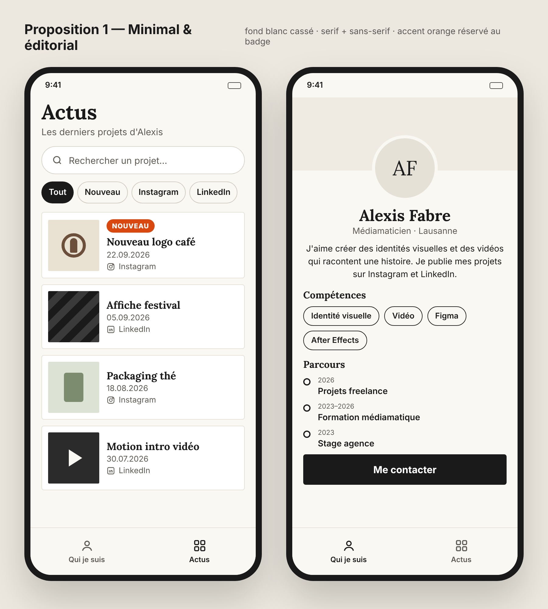
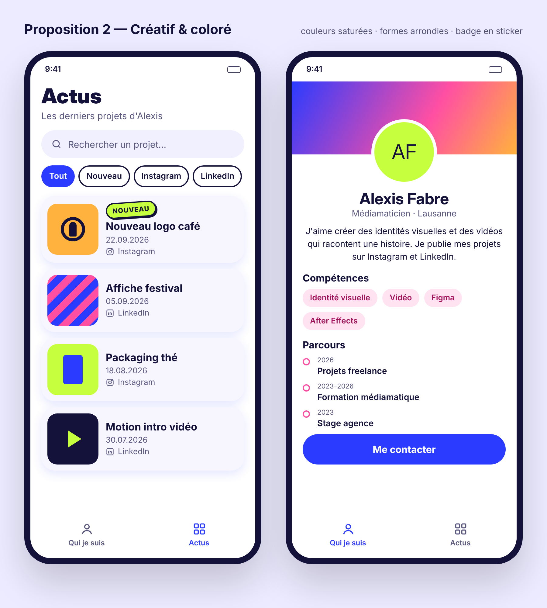
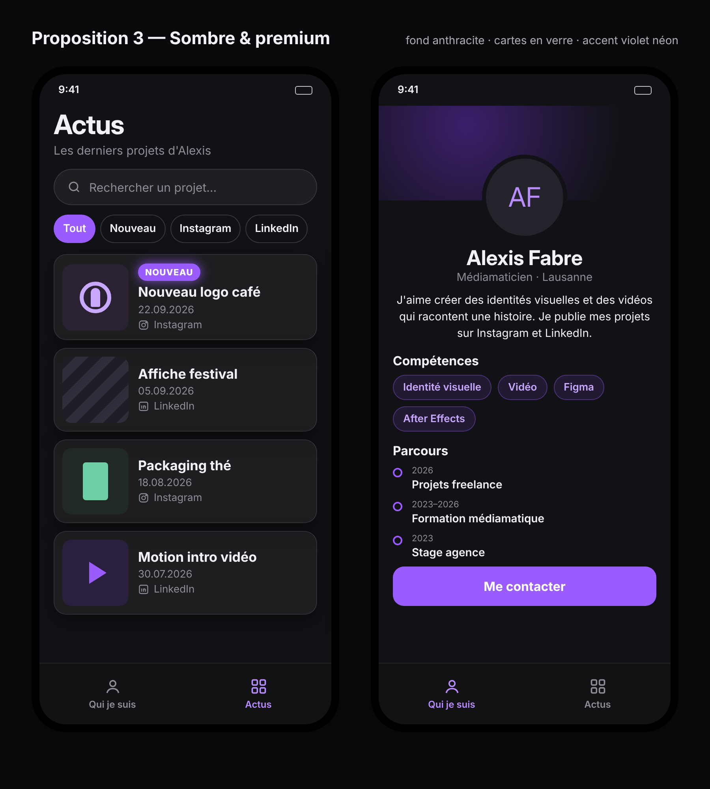

# Critique comparative des propositions de design

**Projet :** AVisual App · **Auteur :** Alexis Fabre · **Date :** 03.10.2026
**Propositions :** `design/propositions/proposition-1.png`, `-2.png`, `-3.png`
**Outil IA :** Claude (maquettes haute fidélité générées en HTML/CSS à partir des prompts de `propositions/README.md`, puis capturées en PNG — même principe que v0.dev)

## 1. Critères d'évaluation

Chaque critère est noté de 1 (faible) à 5 (excellent). Le poids reflète l'importance pour Sarah et pour la tâche n°1.

| # | Critère | Question | Poids |
|---|---|---|---|
| C1 | Badge « Nouveau » | Le nouveau post se repère-t-il en moins de 2 secondes ? | ×3 |
| C2 | Lisibilité | Titres, dates et texte lisibles sur téléphone, contraste suffisant (WCAG AA) ? | ×2 |
| C3 | Clarté de la navigation | Les onglets, la recherche et les puces de filtre sont-ils évidents ? L'élément actif est-il visible ? | ×2 |
| C4 | Image professionnelle | Une recruteuse prendrait-elle Alexis au sérieux ? | ×2 |
| C5 | Cohérence avec le wireframe | Les éléments du wireframe sont-ils tous présents et au bon endroit ? | ×1 |
| C6 | Faisabilité en 4 semaines | Peut-on le coder sans effets trop complexes ? | ×2 |

Contrastes mesurés avec la formule WCAG (même calcul que WebAIM Contrast Checker) :

| Élément | Prop. 1 | Prop. 2 | Prop. 3 |
|---|---|---|---|
| Texte principal | 16,4:1 ✅ | 17,8:1 ✅ | 16,6:1 ✅ |
| Dates (texte gris) | 6,9:1 ✅ | 6,2:1 ✅ | 5,1:1 ✅ |
| Badge « NOUVEAU » | 4,3:1 ⚠️ | 15,1:1 ✅ | 3,9:1 ❌ |

## 2. Analyse de chaque proposition

### Proposition 1 — Minimal & éditorial

- **Points forts :** le badge orange est le **seul élément coloré** de l'écran, donc l'œil le trouve tout de suite. Les titres en serif (Lora) donnent un côté « book de graphiste » sérieux. Beaucoup d'air, cartes bien alignées, hiérarchie claire : un gros titre « Actus », puis la recherche, puis les cartes.
- **Points faibles :** le badge blanc sur orange n'atteint que 4,3:1, juste sous les 4,5:1 demandés. L'onglet actif n'est signalé que par le noir face au gris : c'est un peu discret. Peut paraître trop sobre pour un profil créatif.
- **Problèmes générés par l'IA :** la photo de profil est remplacée par des initiales « AF » ; les miniatures de projets sont des formes abstraites, pas mes vrais visuels.

### Proposition 2 — Créatif & coloré

- **Points forts :** montre clairement la créativité, ambiance mémorable. Le badge vert citron en « sticker » a le meilleur contraste (15,1:1). L'onglet actif et la puce « Tout » en bleu sont très visibles.
- **Points faibles :** **trop de couleurs en même temps** (bleu, rose, orange, vert citron) : le badge « NOUVEAU » est vert citron… comme la miniature « Packaging thé », donc il ne ressort plus. Le dégradé derrière la photo attire plus l'œil que le contenu. Moins crédible pour une recruteuse d'agence.
- **Problèmes générés par l'IA :** initiales à la place de la photo ; le badge penché (rotation) est sympa mais demande un réglage fin pour ne pas toucher le titre.

### Proposition 3 — Sombre & premium

- **Points forts :** moderne, élégant, met en valeur les visuels. L'effet lumineux autour du badge attire le regard.
- **Points faibles :** le violet est utilisé **partout** (badge, puce active, onglet, étiquettes, bouton, cercles du parcours), donc le badge n'est plus le seul signal. Badge blanc sur violet à 3,9:1 : **sous le minimum WCAG AA**. Un écran sombre se lit mal en plein soleil (Sarah entre deux rendez-vous dehors).
- **Problèmes générés par l'IA :** initiales à la place de la photo ; les cartes « verre » transparentes donnent des contrastes qui changent selon le fond, à vérifier écran par écran.

## 3. Tableau comparatif

| Critère | Poids | Prop. 1 | Prop. 2 | Prop. 3 |
|---|---|---|---|---|
| C1 Badge « Nouveau » | 3 | 4 | 3 | 3 |
| C2 Lisibilité | 2 | 5 | 4 | 4 |
| C3 Navigation | 2 | 4 | 5 | 4 |
| C4 Image pro | 2 | 5 | 3 | 4 |
| C5 Fidélité wireframe | 1 | 4 | 4 | 4 |
| C6 Faisabilité | 2 | 5 | 4 | 4 |
| **Total pondéré (/60)** | | **54** | **45** | **45** |

*Calcul : somme de (note × poids). Ex. prop. 1 : 4×3 + 5×2 + 4×2 + 5×2 + 4×1 + 5×2 = 54.*

## 4. Choix final et direction artistique

**Proposition retenue :** n° 1 — Minimal & éditorial

**Pourquoi :** c'est la proposition où le badge « Nouveau » ressort le mieux, parce que l'orange est la seule couleur de l'écran : c'est le cœur de la tâche n°1 de Sarah. Elle a aussi l'image la plus professionnelle pour une recruteuse et c'est la plus simple à coder en CSS avec des variables. Elle gagne avec 54/60 contre 45 pour les deux autres.

**Éléments repris des autres propositions :**
- de la **proposition 2** : un onglet actif plus visible (icône + texte dans la couleur d'accent, pas seulement en noir) ;
- de la **proposition 3** : des miniatures de projets plus grandes et plus sombres pour mettre les visuels en valeur sur la fiche projet.

### Direction artistique retenue

| Élément | Choix |
|---|---|
| Couleur de fond | #FAF8F3 (blanc cassé) |
| Couleur des cartes | #FFFFFF, bordure 1 px #E6E1D7 |
| Couleur du texte | #1A1A1A · texte secondaire #5E5A54 |
| Couleur d'accent (badge, onglet actif) | #C2410C (orange plus foncé que la proposition, pour passer à 5,2:1 avec du texte blanc) |
| Police des titres | Lora (serif) |
| Police du texte | Inter (sans-serif) |
| Forme des cartes | coins arrondis 4 px, pas d'ombre |
| Ambiance en 3 mots | sobre, éditorial, professionnel |

**Modifications à apporter par rapport à l'image de l'IA :**
1. Assombrir l'orange du badge de #D9480F à #C2410C pour respecter 4,5:1.
2. Mettre l'onglet actif dans la couleur d'accent.
3. Remplacer les initiales « AF » par ma vraie photo (avec un `alt`).
4. Remplacer les miniatures abstraites par les vrais visuels de mes projets.
5. Vérifier qu'en 360 px de large, les 4 puces de filtre tiennent encore sur une ligne (sinon, défilement horizontal).
