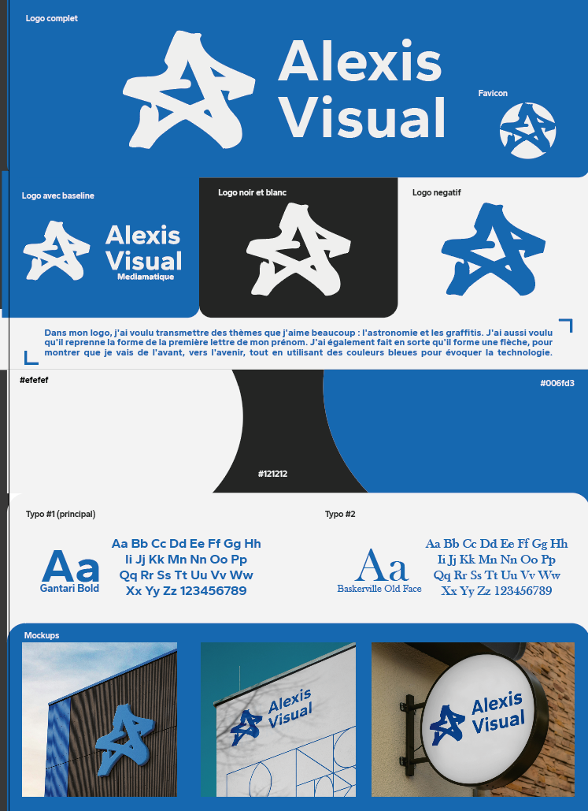

# Direction artistique — Alexis Visual

Ma charte graphique personnelle, appliquée à AVisual App.
Planche complète : `design/charte-alexis-visual.png` · Maquette : `design/maquette-finale.png`



## Le logo

Une étoile en style graffiti qui reprend la forme du **A** de mon prénom.

- **Astronomie** (l'étoile) et **graffiti** (le trait) : deux thèmes que j'aime.
- La forme fait aussi une **flèche** : je vais de l'avant, vers l'avenir.
- Le **bleu** évoque la technologie.

Versions : logo complet, logo avec baseline « Médiamatique », noir et blanc, négatif (bleu sur clair), favicon rond.

Dans l'app : logo clair dans l'en-tête bleu, en filigrane sur « Qui je suis », favicon pour l'onglet du navigateur et l'icône de l'app.

## Couleurs

| Rôle | Hex | Où dans l'app |
|---|---|---|
| Clair | `#efefef` | fond des écrans |
| Noir | `#121212` | texte, puce de filtre active, fond des visuels sombres |
| Bleu | `#006fd3` | badge « NOUVEAU », onglet actif, boutons, en-têtes, étiquettes |
| Blanc (neutre ajouté) | `#ffffff` | cartes, barre de recherche, barre d'onglets |
| Gris (neutre ajouté) | `#5a5a5a` | dates, textes secondaires |
| Erreur (ajouté) | `#c62828` | messages d'erreur du formulaire, toujours avec un texte |

**Règle d'accessibilité :** le bleu `#006fd3` sur le clair `#efefef` ne fait que 4,3:1. Le petit texte bleu va donc **sur une carte blanche** (5,0:1), et le bleu sur fond clair est réservé aux grands titres et aux aplats.

## Typographies

| Rôle | Police | Usage |
|---|---|---|
| Principale | **Gantari Bold** (Google Fonts, gratuite) | titres, boutons, puces, textes d'interface |
| Secondaire | **Baskerville Old Face** → en web : **Libre Baskerville** (Google Fonts, gratuite) | sous-titres en italique, descriptions de projets, citation de la bio |

Baskerville Old Face n'est pas une police web libre : Libre Baskerville est la version gratuite la plus proche.

## Formes

- Cartes : coins arrondis 18 px, fond blanc.
- En-têtes : bloc bleu avec un grand arrondi en bas à gauche (46 px), comme les blocs de la planche.
- Boutons et puces : entièrement arrondis.

## Pour le CSS (semaine 9)

```css
:root {
  --clair: #efefef;
  --noir: #121212;
  --bleu: #006fd3;
  --blanc: #ffffff;
  --gris: #5a5a5a;
  --erreur: #c62828;

  --police-titre: "Gantari", system-ui, sans-serif;
  --police-accent: "Libre Baskerville", Georgia, serif;

  --rayon-carte: 18px;
  --rayon-entete: 0 0 0 46px;
}
```
